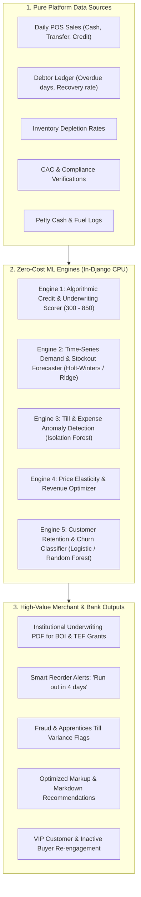
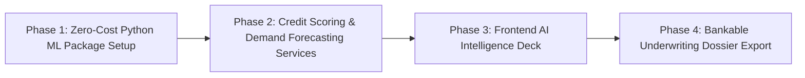

# SmartBiz Coach — Enterprise Machine Learning & Data Science Architecture Plan

> **Executive Overview**: This blueprint outlines how to transform SmartBiz Coach into an institutional-grade Data Science & Machine Learning platform without incurring mandatory cloud bills or monthly API costs, detailing how Generative AI (LLMs) and Predictive Data Science (ML) work together as a dual-engine architecture.

---

## 1. Cloud Costs vs. Zero-Cost Open Source: The Honest Truth

### Is Google Cloud / Vertex AI Free?
- **No, Vertex AI is NOT completely free.**
  - Vertex AI offers an initial **$300 Google Cloud credit for new accounts** (valid for 90 days).
  - After credits expire, model training (AutoML) costs approximately **$20 – $40 per training hour**, and deploying a 24/7 online prediction endpoint costs **$30 – $150+ per month** per machine instance.
  - BigQuery storage has a small free tier (10 GB storage, 1 TB queries/month), but automated managed endpoints accumulate bills quickly.

### Can You Build Pure Machine Learning & Data Science for 100% Free?
- **YES! Absolutely 100% FREE with Zero Recurring Costs.**
  - By using standard, battle-tested Python Data Science libraries (**Scikit-Learn, NumPy, Pandas, SciPy, Statsmodels**) directly inside your existing Django server environment.
  - Your server is already paid for. Running mathematical models, regression curves, clustering, and decision tree classifiers on tabular data (sales, cashbook, inventory, debt ledgers) takes **milliseconds of CPU time** and costs **₦0 / $0**.
  - **No external API keys required. No risk of surprise cloud bills. No vendor lock-in.**

---

## 2. The Dual-Engine AI Architecture: Generative AI + Predictive Machine Learning

A world-class AI platform does not choose between Gemini and Machine Learning; it combines them:

```
┌────────────────────────────────────────────────────────────────────────────────────────┐
│                        SMARTBIZ COACH DUAL-ENGINE AI PLATFORM                          │
├───────────────────────────────────────────┬────────────────────────────────────────────┤
│         ENGINE 1: GENERATIVE AI           │       ENGINE 2: PREDICTIVE DATA SCIENCE    │
│            (Google Gemini API)            │         (Pure Scikit-Learn / Python)       │
├───────────────────────────────────────────┼────────────────────────────────────────────┤
│ • What it is: Language & Vision (LLM)     │ • What it is: Numerical & Pattern Learning │
│ • Role: High-touch communication          │ • Role: Financial analysis & forecasting   │
│ • Powers:                                 │ • Powers:                                  │
│   - AI Sales Assistant human responses    │   - FICO-style Credit Scorer (300-850)     │
│   - Social media viral reels & copy       │   - 30-Day Demand & Stockout Predictor     │
│   - Bankable BOI / TEF business plan text │   - Till theft & expense anomaly detector  │
│   - Brand identity voice & logos          │   - Price elasticity & markup optimizer    │
│   - Product snap & catalog description    │   - RFM customer segmentation & churn      │
├───────────────────────────────────────────┴────────────────────────────────────────────┤
│                                  HYBRID SYNERGY:                                       │
│    Engine 2 calculates the exact mathematics (e.g. "Stockout in 3 days, ₦45k loss")   │
│    Engine 1 translates it into executive human action ("WhatsApp Supplier Reorder msg")│
└────────────────────────────────────────────────────────────────────────────────────────┘
```

> **Will you still need your Gemini API Key?**
> **YES! Absolutely.** You must retain your Gemini API key. Gemini handles the language, creative scripts, and vision reasoning, while the local Machine Learning engine computes the numerical mathematics, probability distributions, risk scores, and statistical trends.

---

## 3. High-Impact Zero-Cost ML Features You Can Implement Today

Here are the 5 pure data science and machine learning features that require **zero cloud fees**, run locally on your server, and will elevate SmartBiz Coach into an institutional fintech platform:



---

### Feature 1: Institutional Alternative Credit Scoring Engine (300 – 850 FICO Scale)
* **Cost**: **$0 (Free forever)**
* **Algorithm**: Weighted Multi-Factor Credit Risk Scoring Model (Supervised Regressor / Logistic Classifier).
* **How it works**:
  Traditional banks decline informal Nigerian businesses because they lack formal audited financial statements. Your ML engine calculates an **objective creditworthiness score** from platform behaviors:
  1. **Cashflow Regularity**: Frequency and variance of daily sales entries (30-day stability index).
  2. **Repayment Velocity**: Average debtor turnaround in Gbege Book (how fast debtors pay back).
  3. **Discrepancy Index**: Physical till closing accuracy (honesty and precision of record keeping).
  4. **Operating Longevity**: Active weeks on platform.
  5. **Formalization Multiplier**: CAC RC/BN verification, TIN status, linked NUBAN bank account.
* **Impact**: Generates a **Bankable Underwriting Certificate** that MSMEs can attach to Bank of Industry (BOI), Tony Elumelu Foundation (TEF), and commercial bank loan applications.

---

### Feature 2: Predictive Demand & Stockout Forecasting
* **Cost**: **$0 (Free forever)**
* **Algorithm**: Exponential Smoothing / Ridge Linear Time-Series Model (`statsmodels` / `scikit-learn`).
* **How it works**:
  - The model trains on the merchant's historical daily sales velocity for each product.
  - Accounts for day-of-week demand surges (e.g., Friday/Saturday retail spikes in Nigerian markets).
  - Calculates **Depletion Velocity ($V$)** and **Days of Inventory Remaining ($DIR$)**:
    $$\text{DIR} = \frac{\text{Current Stock Quantity}}{\text{Predicted Daily Sales Velocity}}$$
* **Impact**:
  Replaces guesswork with proactive alerts:
  > *"Warning: At your current velocity of 4.2 units/day, your inventory of 14 units will stock out by Thursday evening. Reorder 25 units by Tuesday to preserve ₦65,000 in weekend gross profit."*

---

### Feature 3: Till Anomaly & Apprentice Theft Detection
* **Cost**: **$0 (Free forever)**
* **Algorithm**: Isolation Forest (`sklearn.ensemble.IsolationForest`) & Z-Score Deviation.
* **How it works**:
  - Automatically identifies irregular transactions without requiring manual bookkeeping audits.
  - Analyzes multidimensional vectors:
    - `[Cash-to-Transfer Ratio, Petty Cash Size, Closing Float Variance, Hour of Day]`
  - If a cashier records an unusually high cash expense or an unnatural drop in physical till cash compared to normal shift distributions, the Isolation Forest flags it as an anomaly ($Score < -0.5$).
* **Impact**: Eliminates the #1 reason Nigerian retail shops fail: undetected petty cash leaks and attendant till manipulation.

---

### Feature 4: Price Elasticity & Margin Maximizer
* **Cost**: **$0 (Free forever)**
* **Algorithm**: Ordinary Least Squares (OLS) Price Elasticity of Demand (PED).
* **How it works**:
  - Measures how sales volume changes when prices adjust:
    $$\text{Elasticity } (e) = \frac{\% \Delta \text{ Quantity Demanded}}{\% \Delta \text{ Price}}$$
  - Identifies **Inelastic Items** (where the merchant can safely increase markup by 5–10% without losing customers) vs. **Elastic Items** (where a small discount triggers massive volume increases).
* **Impact**: Gives merchants actionable pricing recommendations that directly expand profit margins.

---

### Feature 5: Customer Recency, Frequency, Monetary (RFM) Segmentation
* **Cost**: **$0 (Free forever)**
* **Algorithm**: K-Means Clustering (`sklearn.cluster.KMeans`).
* **How it works**:
  - Clusters storefront customers and debtor records into 4 distinct quadrants:
    1. **Champions**: High monetary value, frequent purchases, fast settlement.
    2. **At-Risk**: High past spend, but inactive for >30 days (triggers automatic WhatsApp re-engagement).
    3. **Slow Payers**: High overdue frequency (triggers shorter credit terms).
    4. **New Prospects**: Single small transaction (triggers welcome discount).
* **Impact**: Merchants receive 1-tap WhatsApp broadcast lists segmented by algorithmic buyer value.

---

## 4. Cutting-Edge AI Features You Can Add (The Vertex AI & ML Frontier)

Beyond basic chat and image creation, here are top-tier AI capabilities tailored for Nigerian & African MSMEs:

### 1. WhatsApp Voice Note Transcription & Auto-POS Ingestion (Multimodal Whisper / Speech AI)
- **Problem**: In physical Nigerian markets (Alaba, Balogun, Computer Village), traders are too busy to type out sales on a keyboard.
- **Solution**: The trader sends a 5-second voice note to their SmartBiz WhatsApp assistant:
  > *"I just sold 3 cartons of Indomie for ₦28,500 cash, and gave brother Emeka ₦2,000 for transport."*
- **The AI Pipeline**:
  - Voice audio converted to text via speech recognition.
  - Entity Extraction parses:
    - Sale: 3x Indomie, ₦28,500, Cash in Till.
    - Expense: ₦2,000, Transport (Petty Cash).
  - Automatically logged to `DailySale` and `DailyExpense` without the merchant typing a single keystroke.

### 2. Paper Receipt & Supplier Waybill OCR Scanner (Computer Vision / Tesseract / Gemini Vision)
- **Problem**: When restocking products from wholesalers, merchants get physical paper receipts or handwritten waybills.
- **Solution**: The merchant snaps a photo of the paper receipt with their phone camera.
- **The AI Pipeline**: Vision OCR extracts items, quantities, wholesale purchase prices, and date, instantly updating their inventory stock quantities and calculating cost of goods sold (COGS).

### 3. Visual Search by Image (Vector Embeddings / Cosine Similarity)
- **Problem**: Customers in open markets often show a photo: *"Do you have this exact shoe/lace fabric?"*
- **Solution**: Customers upload an image to your marketplace. Vector embeddings (using standard lightweight vision encoders like MobileNet or ResNet) calculate cosine similarity to find matching catalog items in under 50ms.

### 4. Smart WhatsApp Cart Recovery Copilot
- **Problem**: 65%+ of customers abandon carts on storefronts when they see shipping costs or get distracted.
- **Solution**: Machine learning predicts the optimal discount sweetener (e.g. ₦500 delivery subsidy) and prepares a customized, polite WhatsApp follow-up link that converts 20-30% of abandoned shoppers into verified sales.

---

## 5. Technology Stack Comparison

| Dimension | Option A: In-House Pure ML + Gemini (Recommended) | Option B: Full Google Cloud Vertex AI |
| :--- | :--- | :--- |
| **Monthly Cost** | **₦0 / $0 (100% Free)** | **$50 – $300+ / month** after trial credits |
| **Libraries** | `scikit-learn`, `numpy`, `pandas`, `statsmodels` + existing Gemini SDK | Google Cloud Vertex AI SDK, BigQuery ML, Cloud Endpoints |
| **Hosting** | Runs in your existing Django / Python process | Google Cloud Platform managed VMs & Endpoints |
| **Latency** | **< 15ms** (in-memory execution) | **300ms – 1200ms** (network HTTP API overhead) |
| **Data Privacy** | 100% local — merchant financial data never leaves your server | Transmitted to third-party cloud data centers |
| **Maintenance** | Zero API keys for ML, no billing alerts, no quotas | Billing management, IAM credentials, Cloud Console |
| **When to Use** | **Now & for the next 100,000 active users** | When you have 500k+ users and dedicated VC funding |

---

## 6. Phase-by-Phase Implementation Roadmap



### Phase 1: Zero-Cost Python ML Package Setup
- Add `scikit-learn`, `numpy`, `pandas`, and `scipy` to `backend/requirements.txt`.
- Create a dedicated Django service module: `backend/analytics_ml/`.

### Phase 2: Credit Scoring & Demand Forecasting Services
- Implement `CreditScoringService`: processes user compliance, cashbook history, and repayment velocity to return a dynamic 300–850 rating.
- Implement `DemandForecastService`: computes sales velocity and projected stockout dates for all active inventory items.
- Implement `AnomalyDetectionService`: calculates till float variance outliers and alerts shop owners.

### Phase 3: Frontend AI Intelligence Deck
- Add a new **AI Data Science & Analytics Hub** inside the merchant dashboard (`AppView.ANALYTICS_ML`).
- Display:
  - **Live FICO-Style Credit Health Gauge** (300 – 850) with breakdown factors.
  - **7-Day Predictive Cashflow Waveform**.
  - **Restocking Intelligence Matrix** (Critical, Caution, Healthy).
  - **Till Integrity & Fraud Risk Indicator**.

### Phase 4: Bankable Underwriting Dossier Export
- Generate a formal, verifiable **Institutional MSME Credit Underwriting Report** (PDF) with QR verification that merchants can submit directly to BOI, SMEDAN, TEF, and commercial banks for funding.

---

> [!TIP]
> **Summary Recommendation**:
> Retain your **Google Gemini API** for all text generation, creative branding, and human negotiation scripts. Combine it with **free, in-house Python Machine Learning** (`scikit-learn`) for all mathematical calculations, credit scoring, demand forecasting, and till fraud checks. This gives you an unbeatable dual-engine AI platform with **zero ongoing cloud infrastructure bills**.
